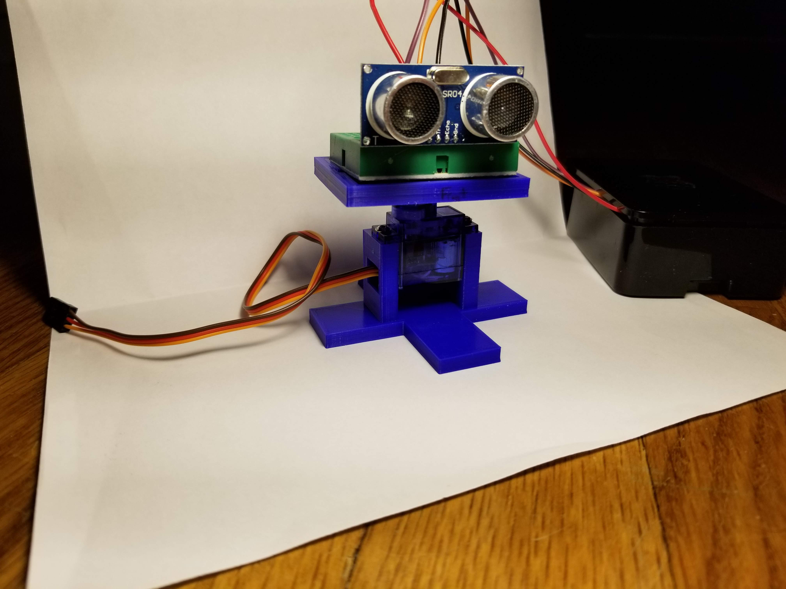
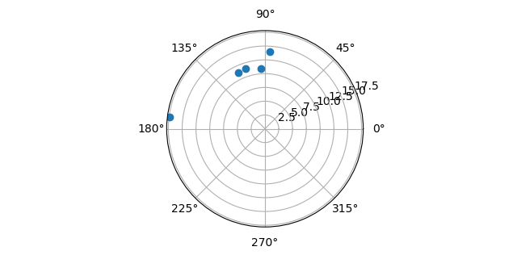
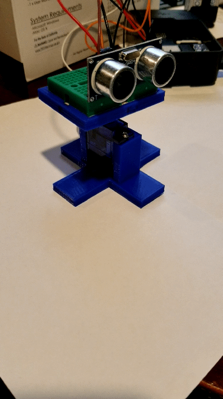

# Raspberry Pi Sonar

Using an HCSR04 ultrasonic sensor mounted on a servo in a custom 3D printed mount, I wrote a simple script that sweeps the sensor back and forth over the servo's 180 degree range and shows objects within 50cm of the sensor as seen in the image below. At the end of each sweep, existing data points are replaced with new ones. The range can be adjusted to "see" objects as close as 2cm and as far as 4m as per the spec sheet for the HCSR04. The sensor is powered directly from the Raspberry Pi and the servo is powered by an attached 4 AA battery pack (not shown).

### Short gif of operation 

### Note on 3D Printed Mount

The servo mount is included in the "stl files" folder. The settings used to print it are listed below:
* Creality Ender 3 Pro Printer
* Hatchbox PLA filament
* 200c extruder temp
* 50c bed temp
* 50mm/s print speed 
* 0.2mm layer height
* 25% infill
